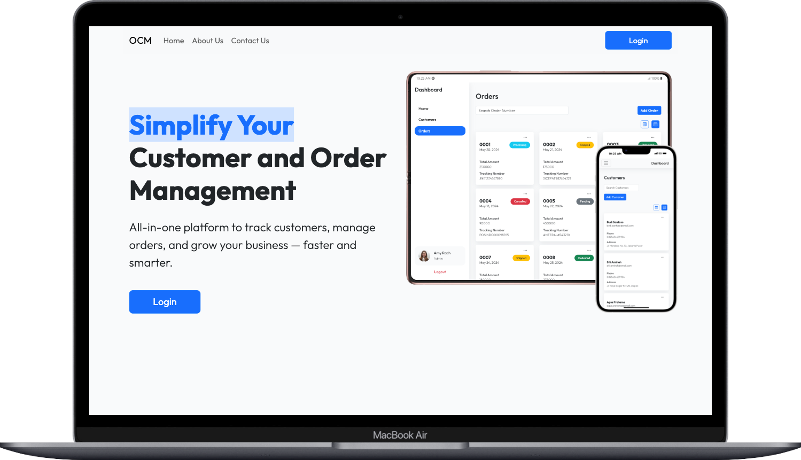
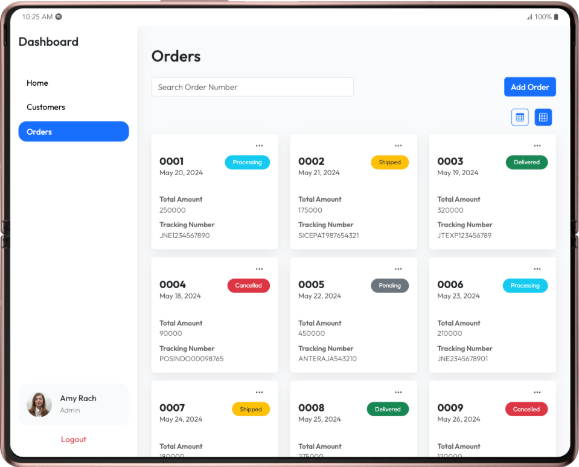

# 🚀 OCM (Order and Customer Management) 🎉

Welcome to OCM! An all-in-one platform to manage your customers and orders efficiently, easily, and quickly. Perfect for modern businesses aiming to grow better! 🛒👩‍💻

## 🖼️ Preview Screenshots

Take a look at OCM in action! 👇

<p align="center">
  
</p>
<p align="center">
  
  
</p>

## ✨ Main Features

- Manage customers & orders in a single dashboard
- Interactive grid & table views
- Powerful search & data filtering
- Full CRUD for customers & orders
- Export & download data
- Modern and responsive UI

## 📦 Installation

1. Clone this repo:
   ```bash
   git clone https://github.com/thoriqdharmawan/ocm
   cd customer-and-order-management
   ```
2. Install dependencies:
   ```bash
   npm install
   ```
3. Run the app:
   ```bash
   npm run dev
   ```

## 🐳 Run with Docker

1. Build the image:
   ```bash
   docker build -t ocm-app .
   ```
2. Run the container:
   ```bash
   docker run -p 8080:80 ocm-app
   ```

Access the app at [http://localhost:8080](http://localhost:8080) 🌐

## 🛠️ Tech Stack

- React 19 ⚛️
- Vite ⚡
- TypeScript 💙
- Bootstrap 5 🎨
- React Query 🔄
- Axios 🌐

